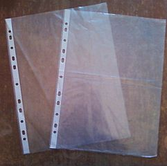

# Sweet Test File

A simple test `Markdown` file turned into a `Deck.js` app.

# A second title slide

With a second subtitle

that has two lines

## First Slide

Some cool content about nothing more interesting than what I can think of while riding the train home.

## Second Slide

I just passed a row of stoage units that were completly empty.

Is this a sign that we are less materialistic?

* Yes
* No

## Third Slide

# Title witout subtitle

## Slide Four

This was almost blank

## Slide Five - The Blank One

## Slide Six

### We should probs test a bunch of header sizes

#### We should probs test a bunch of header sizes

##### We should probs test a bunch of header sizes

## The Last Slide - A review

1. Title 1
1. Title 2
	1. Slide 1
	1. Slide 2
	1. Slide 3
1. Title 3
	1. Slide 4
	1. Slide 5
	1. Slide 6
	1. Slide 7
1. Title 4

# The End
